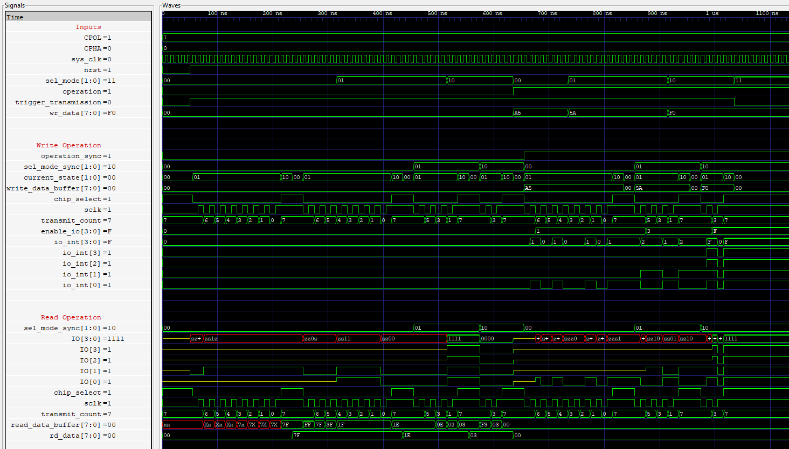

# QSPI
RTL Implementation of the Quad Serial Peripheral Interface Protocol.
- Supports serial, dual and quad.

- Working on implementing a top module to perform read and write operation to a Flash Memory.